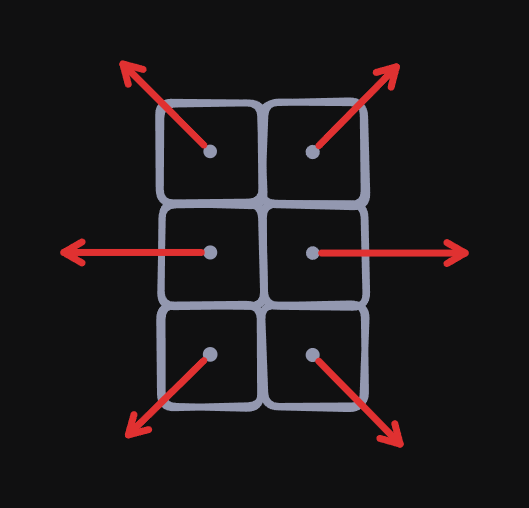
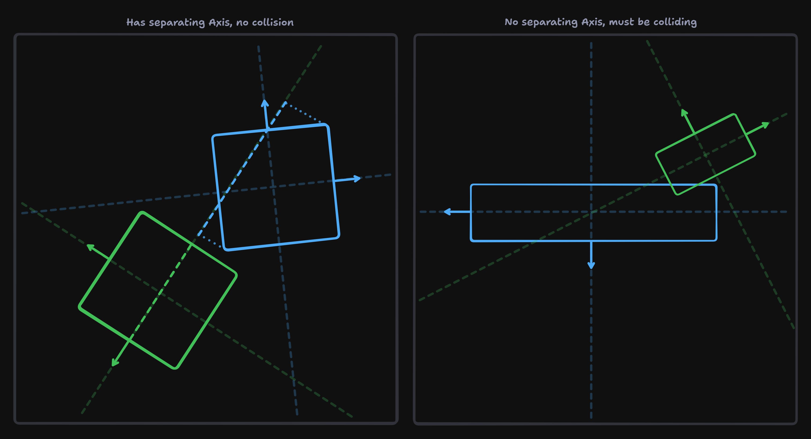
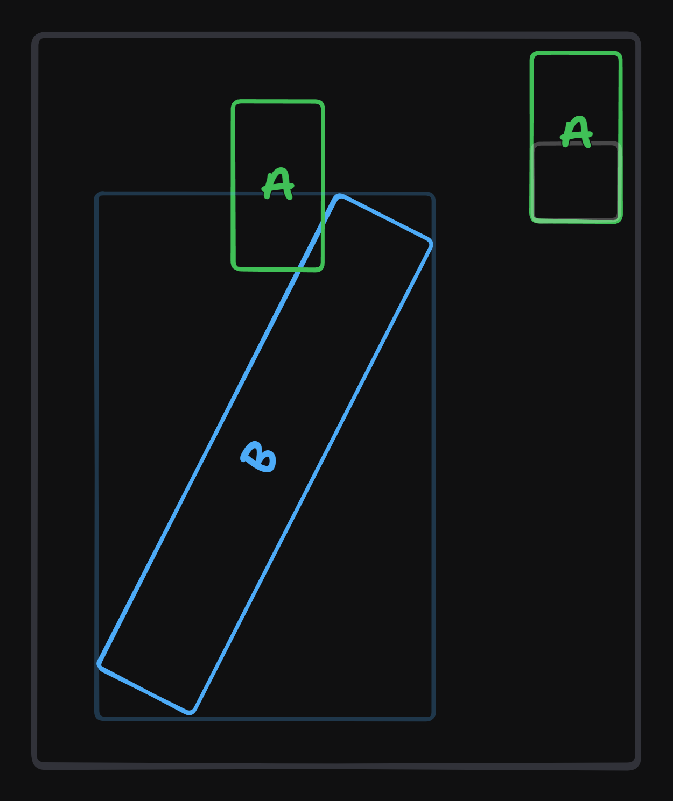
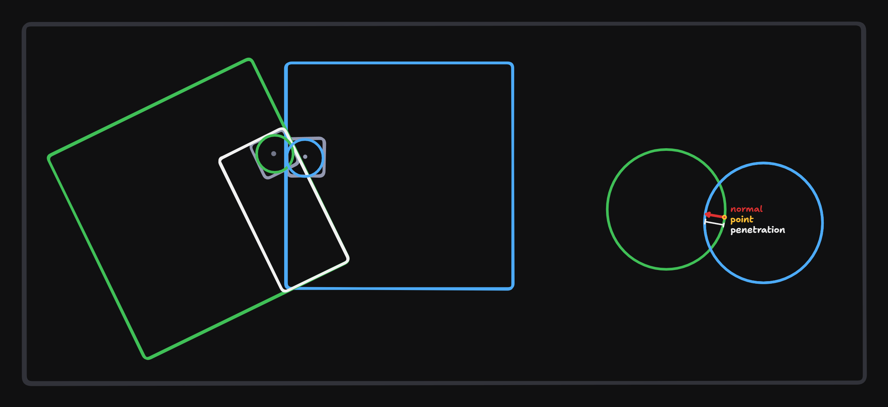
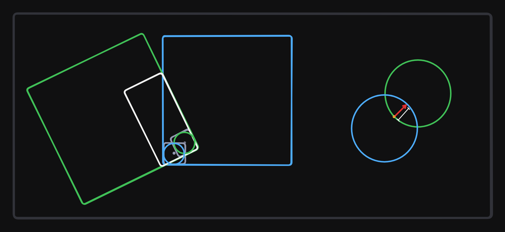

# Voxel Physics 
*by Milan Bonten*

- [Introduction](./#introduction)
- [Voxel Data](./#voxel-data)
- [Collision detection](./#collision_detection)
    - [Early out](./#early-out)
    - [Shape Overlap](./#shape-overlap)
    - [Voxel Transformation](./#voxel-transformation)
- [Contact generation](./#contact-generation)
    - [Basic contact](./#basic-contact)
    - [Normal Lookup](./#normal-lookup)
    - [Voxel types](./#voxel-types)
- [Contact solving](./#contact-solving)
    - [Rigidbody properties](./#rigidbody-properties)
    - [Velocity Solving](./#velocity-solving)
    - [Friction](./#friction)
    - [Position Solving](./#position-solving)


## Introduction

In this post I'm going to talk about how I did voxel physics. There are some limitations in my voxel physics implementation. First of all it is discrete, meaning it checks collision on a fixed timestep. So with a big enough timestep and a fast enough moving object, things can faze through each other. Secondly the performance isn’t great yet. I got about 100 dynamic voxel object running in ~10 milliseconds, if you make use of sleep states it you can have hundreds of objects in your scene, but again only about a hundred active, but there are a lot of places that can still be optimized. And third, this is not a full fletched physics engine yet, its missing features like callbacks on collisions, collision triggers, tags, raycasts, etc.

The structure of the voxel physics loop looks like this (in order):
- For all rigidbodies, we apply the "applied velocities" meaning the outside velocities like impulses from the game and gravity.
- We do collision detection between all rigidbodies save contact points when two bodies collide.
- We solve the velocities with the itteritive constraint solver from the contact points.
- We apply the new velocities to the bodies and transform them accordingly.
- We solve the positions from the contact points.

Doing this gave me the following result:

<video width="100%" controls>
  <source src="./media/final_product_demo.mp4" type="video/mp4">
</video>

keep in mind that in all my code snipets I use a game engine provided by school, this contains rendering, transforms and ECS. 

## Voxel Data

I have a `VoxelCollider` class that stores the voxel shape data, in a vector of voxels, and the `width`, `height` and `depth` (x, y, z) of the oriented bounding box that the voxel object is inside of in world scale, not voxel scale. We use this oriented bounding box (OBB) to do the early out and the shape overlap. In other words, voxelcolliders are OBB's with a 3d voxel grid inside them.

```cpp
class VoxelCollider
{
public:
    float width = 0.0f;
    float height = 0.0f;
    float depth = 0.0f;

    VoxelData voxels = {};
}
```

|||
|-|-|
|The voxels them self have a voxel type that indicate the type of geometry the voxel is. This geometry type is used to reduce the number of contacts and collision checks. It goes hand in hand with the `normal_index`. Every voxel can have a certain number of normals based on its surrounding voxels. Saving both of these values can be stored in a single byte in C++, as I have done in my voxel class. |  |
|||

```cpp
enum VoxelType : uint8_t
{
    Empty,
    Corner,
    Edge,
    Face,
    Inside
};

struct Voxel
{
    VoxelType type : 3;
    uint8_t normal_index : 5;
};
```

The usage of the `type` and `normal_index` will be explained later in the post.


##  Collision detection

### Early out

The very first step of the collision detection is looping over all rigidbodies with voxel colliders and checking if there is a OBB collision. You can use any collision detection method, but I used separating axis theorem (SAT). 

|||
|-|-|
| The idea of SAT is that you check if there is any axis that you are not overlapping on. The axes that you are checking are the normals of the faces, and the cross products between the normals. In our case, we only have 3 normals because the face on the other side of the box has the same axis. SAT says that if there is any axis that is not overlapping we know we can't be colliding. | |
|||

`vert_a` and `vert_b` contain the vertices of their OBB in world space. `axes_a` and `axes_b` contain 3 vectors containing the normals of their OBB in world space. If `sat_early_out` returns true, we know we can early out, so we don't need to continue with collision detection.

```cpp
bool bee::PhysicsSystem::sat_early_out(const Transform& transform_a,
                                       const VoxelCollider& vox_a,
                                       const Transform& transform_b,
                                       const VoxelCollider& vox_b)
{
    auto vert_a = vox_a.get_world_bounds(transform_a);
    auto vert_b = vox_b.get_world_bounds(transform_b);
    auto axes_a = vox_a.get_axes(transform_a);
    auto axes_b = vox_b.get_axes(transform_b);

    // Check against all axes
    for (size_t i = 0; i < 3; i++)
    {
        if (is_separated(axes_a[i], vert_a, vert_b)) return true;
        if (is_separated(axes_b[i], vert_a, vert_b)) return true;

        for (size_t j = 0; j < 3; j++)  // edge-edge
        {
            auto cross_axis = glm::normalize(glm::cross(axes_a[i], axes_b[j]));
            if (glm::length(cross_axis) > 0)
            {
                if (is_separated(cross_axis, vert_a, vert_b)) return true;
            }
        }
    }

    return false;
}
```

The way of actually knowing if they are not overlapping on any axis is by testing all of the axes and returning if any seperating axis is found. We do this by projecting the vertices of both objects on the axes and checking if there is any overlap in this line.

```cpp
bool bee::PhysicsSystem::is_separated(const glm::vec3& axis, const Box& box_a, const Box& box_b) const
{
    float min_a = 1e32f, max_a = -1e32f;
    float min_b = 1e32f, max_b = -1e32f;

    for (size_t i = 0; i < 8; i++)
    {
        float projection = glm::dot(box_a.vertex[i], axis);
        min_a = std::min(min_a, projection);
        max_a = std::max(max_a, projection);
    }

    for (size_t i = 0; i < 8; i++)
    {
        float projection = glm::dot(box_b.vertex[i], axis);
        min_b = std::min(min_b, projection);
        max_b = std::max(max_b, projection);
    }

    if (max_a < min_b || max_b < min_a) return true;

    return false;  // Not separated
}
```
This is of course very expensive to do when you check every object in the scene against each other, so this is a perfect place to implement an acceleration like a BVH.

### Shape overlap

If we know that there is a collision between the OBB's we can continue with getting the shape overlap. The reason we need a shape overlap is that its super expensive to check all the voxels in a shape. So we need to reduce the amount of voxel we check as much as possible. 

We want to get the area of the shape that is overlapping, and we want to get the voxels in that area. So we need to get the min and max of 1 object in local voxel space. The method I use is pretty simple, but not the most effective.

|||
|-|-|
| We get the world vertices of object b, and transform them in the local space of object a. Then we want to get the minimum and maximum values in all axis to create an axis aligned `t_min` and `t_max` of the shape. After this we clamp the values to the bounds of object a and convert it to local voxel space to get the area that we want to check. ||
|||

```cpp
void bee::PhysicsSystem::get_overlap(const Transform& transform_a,
                                     const VoxelCollider& vox_a,
                                     const Transform& transform_b,
                                     const VoxelCollider& vox_b,
                                     glm::ivec3& min,
                                     glm::ivec3& max)
{
    const glm::vec3 local_half_a = vox_a.get_dimensions() * 0.5f;
    const auto box_b = vox_b.get_world_bounds(transform_b);

    glm::vec3 t_min = glm::vec3(1e32f);
    glm::vec3 t_max = glm::vec3(-1e32f);
    for (size_t i = 0; i < 8; i++)
    {
        const glm::vec3 relative_vertex = (box_b.vertex[i] - pos_a) * rot_a;

        for (int j = 0; j < 3; j++)
        {
            if (relative_vertex[j] < t_min[j]) t_min[j] = relative_vertex[j];
            if (relative_vertex[j] > t_max[j]) t_max[j] = relative_vertex[j];
        }
    }

    // Clamp and transform into local voxel space for each axis
    for (int j = 0; j < 3; j++)
    {
        min[j] = (int)std::floor((std::clamp(t_min[j] - VOXEL_SIZE, -local_half_a[j], local_half_a[j]) + local_half_a[j]) *
                                 VOXELS_PER_UNIT);
        max[j] = (int)std::floor((std::clamp(t_max[j] + VOXEL_SIZE, -local_half_a[j], local_half_a[j]) + local_half_a[j]) *
                                 VOXELS_PER_UNIT);
    }
}
```

The `min` and `max` will now be the area that we loop over on object a.
```cpp
for (size_t z_a = min.z; z_a < max.z; z_a++)
    for (size_t y_a = min.y; y_a < max.y; y_a++)
        for (size_t x_a = min.x; x_a < max.x; x_a++)
```

### Voxel Transformation
The actual collision detection is a squared distance check. But again, we don't want to do a squared distance check for all the solid voxels in the other shape, we could do another overlap on the other shape. But it makes more sense to just get the current voxel and transform it in to the local voxel space of the other object and check the surrounding voxels.


```cpp
// Transform the voxel from local voxel space A to world space
glm::vec3 local_pos_a = {x_a, y_a, z_a};
local_pos_a *= VOXEL_SIZE;
local_pos_a -= half_scale_a - glm::vec3(VOXEL_SIZE_HALF);
const glm::vec3 world_pos_a = pos_a + rot_a * local_pos_a;

// Transform the voxel from world space to local voxel space B
const glm::vec3 relative_pos = (world_pos_a - pos_b) * rot_b;
glm::ivec3 voxel_coord = {};
for (int i = 0; i < 3; i++)
    voxel_coord[i] = (int)std::floor((relative_pos[i] + half_scale_b[i]) * VOXELS_PER_UNIT);
```

When we have the voxel coordinate of a in the local voxel space of b we can do a collision check against the voxels in a 3x3x3 area around this voxels. We don't need to/want to check all voxels. We want to only check certain combinations of voxel types. An example of why we want this is the following. Imagine you have 2 boxes both of size 256x256x256 stacked on eachother, If we check every voxel against each other we will have 256 * 256 contact points. This is way to many, and not efficient. So that's where the voxel types come in. 

First of all, we obviously don't want to check empty voxels, from both objects. Then the rules that work best for me are corner voxels check against everything, and edge voxels check against other edge voxels.
```cpp
if (voxel_a.type != VoxelType::Corner && !(voxel_a.type == VoxelType::Edge && voxel_b.type == VoxelType::Edge))
    continue;
```

## Contact generation
### Basic contact

Then we do the actual collision check. By getting the world position of both voxels and doing a distance check.

```cpp
// Transform the voxel from local voxel space B to world space
glm::vec3 local_pos_b = {coord.x, coord.y, coord.z};
local_pos_b *= VOXEL_SIZE;
local_pos_b -= half_scale_b - glm::vec3(VOXEL_SIZE_HALF);
glm::vec3 world_pos_b = pos_b + rot_b * local_pos_b;

const glm::vec3 dir = world_pos_b - world_pos_a;
const float dist = glm::length2(dir);

if (dist > VOXEL_SIZE_SQR) continue;
```

Everything after the `continue` is creating the actual contact point. Contact points are stored in collisions. a `Collision` is a class that holds the 2 entities that are involved in the collision, a direction value and a vector of contact points.
```cpp
class Collision
{
public:
    bee::Entity entity_a = entt::null;
    bee::Entity entity_b = entt::null;
    glm::vec3 dir = {};

    std::vector<ContactPoint> contacts = {};
};
```

We create a collision for every pair of objects that collide. And we add contact points for every voxel collision.

Our contacts look like this:
```cpp
struct ContactPoint
{
    glm::vec3 point = {};
    float penetration = 0.0f;
    glm::vec3 normal = {};
    
    // Used during solving
    float tangent_impulse = 0.0f;
    float normal_impulse = 0.0f;
    float normal_mass = 0.0f;
};
```

We fill up are contacts based on the squared distance check values, so we treat our voxels as spheres.



### Normal lookup

The reason we need the normal lookup is for the following example. When a voxel is past a voxel, it will generate a normal that points the wrong way. 



So to fix this we store the local normal of every voxel. We calculate these normals when we read the voxel data by checking the surrounding voxels to see what sides are not solid or outside of the range. Note, some voxels can't have a lookup normal.

If generated normal is in the opposite direction of the transformed lookup normal we need to invert the generated normal.

```cpp
const glm::vec3 lut_normal = (glm::vec3)voxel_a.get_normal() * glm::inverse(rot_a); // Transform local to world normal
const glm::vec3 normal = glm::dot(dir, -lut_normal) < 0 ? glm::normalize(dir) : -glm::normalize(dir); // Check normal direction
contact.normal = normal;
```

### Voxel types

As you might have notices two voxel types have not been used yet. `VoxelType::Face` and `VoxelType::Inside`. For the face type we don't need to do anything. But we can do something interesting with the inside voxels. We can give inside voxels normals based on the "closest point of exit" from that voxel. Meaning we can give it a normal pointing outside of the shape. And when its and Inside voxel, instead of using the penetration, we can just make the `penetration = VOXEL_SIZE` because it is at least 1 voxel deep inside the shape.

The way I know what type of voxel all voxels are is pretty simple. After I read the file data I loop over every voxel, and check how many voxels are neighbouring in all cardinal directions. 

- 0 empty neighbours means its an inside voxel
- 1 empty neighbour means its a face voxel
- 2 empty neighbours means its an edge voxel
- 3 or more empty neighbours means its a corner voxel

And for voxels with more than 3 empty neighbours the normal lookup table doesn't work. But any empty direction gets added to the normal in that direction, the sum of all those values should become one of these values:

```cpp
static const glm::ivec3 normal_lut[26] {
    // Cardinal directions
    {1, 0, 0},  {0, 1, 0},  {0, 0, 1},
    {-1, 0, 0}, {0, -1, 0}, {0, 0, -1},
    // Edge directions
    {1, 1, 0},  {1, 0, 1},  {0, 1, 1},
    {-1, 1, 0}, {-1, 0, 1}, {0, -1, 1},
    {1, -1, 0}, {1, 0, -1}, {0, 1, -1},
    {-1, -1, 0}, {-1, 0, -1}, {0, -1, -1},
    // Corner directions
    {1, 1, 1},  {1, 1, -1},  {1, -1, 1},  {1, -1, -1},
    {-1, 1, 1}, {-1, 1, -1}, {-1, -1, 1}, {-1, -1, -1}
};
```

Because the normals are in local space they need to be transformed and normalized when used.

## Contact solving

I have limited knowledge in physics, so in this part I mostly talk about my implementation of the constraint solver, not how it works in detail. If you want to know more about how constraint solvers work, I highly recommend taking a look at [Understanding Collision Constraint Solvers by Erik Onarheim](https://erikonarheim.com/posts/understanding-collision-constraint-solvers/).

### Rigidbody properties

Rigidbodies need to have the following: friction, elasticity, velocity, angular velocity, inverse mass and inverse inertia. Some other nice to have things could be added: 
- Rigidbody states for checking if a rigidbody is static, dynamic or asleep.
- Linear and angular drag.
- Getters and setters for safer code.

But the most important values can be seen in the code snippet below.

```cpp
class RigidBody
{
public:
    RigidBody() = default;
    
    float inv_mass = 1.0f;
    glm::mat3 inv_inertia{};
    glm::vec3 com_offset = glm::vec3(0);
    glm::vec3 velocity = glm::vec3(0);
    glm::vec3 angular_velocity = glm::vec3(0);
    float elasticity = 0.33f;
    float friction = 0.5f;

    const glm::mat3 get_inv_world_inertia(const Transform& transform) const;
    void compute_mass_intertia(const VoxelCollider& coll, const float density);
};
```

A very important step is calculating the mass and inertia of the voxel shape. The first thing we need to know is the mass and the center of mass, because without we can't calculate the inertia.

We start by looping over all of the voxels. If a voxel is solid we increment `filled_counter` and add the voxel position in local space to `sum`.  After looping over all the voxel we have the amount of solid voxels (`filled_counter`) and the sum of all the solid voxels positions (`sum`). With these values we can calculate the center of mass and inverse mass.

```cpp
size_t filled_counter = 0;
glm::vec3 sum = {};
const glm::vec3 half_scale = glm::vec3(coll.width, coll.height, coll.depth) * 0.5f;

for (size_t z = 0; z < coll.voxels.size.z; z++)
{
    for (size_t y = 0; y < coll.voxels.size.y; y++)
    {
        for (size_t x = 0; x < coll.voxels.size.x; x++)
        {
            if (coll.voxels.get_voxel(x, y, z).type == VoxelType::Empty) continue;

            filled_counter++;
            sum += glm::vec3(x, y, z) * VOXEL_SIZE - half_scale + VOXEL_SIZE_HALF;
        }
    }
}

com_offset = sum / (float)filled_counter;
const float voxel_mass = std::powf(VOXEL_SIZE, 3) * density;
inv_mass = 1.0f / (voxel_mass * filled_counter);
```

When we have the center of mass we can move on to calculating the inverse inertia. We loop over all the voxels, check if the voxel is solid and we convert them from voxel to local space again (`pos`). But now we calculate the vector from the center of mass to the voxel (`r`) and calculate its squared magnitude (`r2`). Then we calculate the moments of inertia (diagonal elements) and the product of inertia (off-diagonal elements) and update the inertia tensor accordingly. After that we make the inertia tensor symmetric, and get the inverse of it.

```cpp
glm::mat3 inertia_tensor(0.0f);
for (size_t z = 0; z < coll.voxels.size.z; z++ )
{
    for (size_t y = 0; y < coll.voxels.size.y; y++)
    {
        for (size_t x = 0; x < coll.voxels.size.x; x++)
        {
            if (coll.voxels.get_voxel(x, y, z).type == VoxelType::Empty) continue;

            const glm::vec3 pos = glm::vec3(x, y, z) * VOXEL_SIZE - half_scale + VOXEL_SIZE_HALF;
            const glm::vec3 r = pos - com_offset;
            float r2 = glm::dot(r, r);

            inertia_tensor[0][0] += voxel_mass * (r2 - r.x * r.x);
            inertia_tensor[1][1] += voxel_mass * (r2 - r.y * r.y);
            inertia_tensor[2][2] += voxel_mass * (r2 - r.z * r.z);
            inertia_tensor[0][1] -= voxel_mass * r.x * r.y;
            inertia_tensor[0][2] -= voxel_mass * r.x * r.z;
            inertia_tensor[1][2] -= voxel_mass * r.y * r.z;
        }
    }
}

inertia_tensor[1][0] = inertia_tensor[0][1];
inertia_tensor[2][0] = inertia_tensor[0][2];
inertia_tensor[2][1] = inertia_tensor[1][2];

inv_inertia = glm::inverse(inertia_tensor);
```

All of these values are going to be in local space, so when we use them later we need to transform them into world space.


### Velocity Solving

The structure of looping over the collisions and contacts looks like this:
```cpp
for (size_t i = 0; i < velocity_iterations; i++)
    for (auto& collision : collisions)
        for (auto& contact : collision.contacts) // Friction
        for (auto& contact : collision.contacts) // Impulse
```

But not every calculation needs to be done in the deepest layer of the nested for loops.

We start by getting the values that we need from both bodies in the collision.
```cpp
const glm::mat3 inv_inertia_a_world = body_a.get_inv_world_inertia(transform_a);
const glm::mat3 inv_inertia_b_world = body_b.get_inv_world_inertia(transform_b);

const float restitution = body_a.elasticity * body_b.elasticity;
const float friction = std::min(body_a.friction, body_b.friction);
```

The inertia we calculated was in local space. So I transform the inertia so it is in world space using this function:
```cpp
const glm::mat3 bee::RigidBody::get_inv_world_inertia(const Transform& transform) const
{
    const glm::mat3 rotation = glm::toMat3(transform.GetRotation());
    return rotation * inv_inertia * glm::transpose(rotation);
}
```

Then the actual solving happens in the contacts. The first thing we do is calculate the values that we need for other calulations. In the end of the loop we need to know how much force we apply in the normal direction (`impulse_delta`). The `effective_mass` is the amount of mass that applies to the normal. `jv` is a value related to the Jacobian. Using these two values and the restitution we can calculate the `impulse_delta`.

```cpp
const glm::vec3 r_a = contact.point - transform_a.GetTranslation();
const glm::vec3 r_b = contact.point - transform_b.GetTranslation();

const glm::vec3 r_a_cross_n = glm::cross(r_a, contact.normal);
const glm::vec3 r_b_cross_n = glm::cross(r_b, contact.normal);

const glm::vec3 i_cross_a = inv_inertia_a_world * r_a_cross_n;
const glm::vec3 i_cross_b = inv_inertia_b_world * r_b_cross_n;

float effective_mass = 1.0f / (inv_mass_a + inv_mass_b + 
                       glm::dot(i_cross_a, r_a_cross_n) + 
                       glm::dot(i_cross_b, r_b_cross_n));
                       contact.normal_mass = effective_mass;

const float jv = glm::dot(contact.normal, body_a.velocity - body_b.velocity) +
                 glm::dot(r_a_cross_n, body_a.angular_velocity) - 
                 glm::dot(r_b_cross_n, body_b.angular_velocity);

float impulse_delta = (1.0f + restitution) * jv * effective_mass;
```

Then we store the `impulse_delta` in the contact for better stability. But the stored impulse always needs to be positive, while the `impulse_delta` can be negative.

```cpp
const float new_impulse = std::max(contact.normal_impulse + impulse_delta, 0.0f);
impulse_delta = new_impulse - contact.normal_impulse;
contact.normal_impulse = new_impulse;
```

And then we just get the actual impulse and apply it and repeat.

```cpp
const glm::vec3 impulse = impulse_delta * contact.normal;

body_a.velocity -= impulse * inv_mass_a;
body_b.velocity += impulse * inv_mass_b;

body_a.angular_velocity -= impulse_delta * i_cross_a;
body_b.angular_velocity += impulse_delta * i_cross_b;
```

### Friction

In a separate loop in contact loop we calculate and apply the friction per contact **before** calculating the impulse. The math is very similar to the impulse calculation. The only things that change are that we now use the tangent for calculation the effective mass (`friction_mass`) and the actual impulse is a different formula. 

```cpp
const glm::vec3 r_a = contact.point - transform_a.GetTranslation();
const glm::vec3 r_b = contact.point - transform_a.GetTranslation();

const glm::vec3 relative_velocity = body_b.velocity + glm::cross(body_b.angular_velocity, r_b) - body_a.velocity -
                                glm::cross(body_a.angular_velocity, r_a);

glm::vec3 tangent = relative_velocity - glm::dot(relative_velocity, contact.normal) * contact.normal;

if (glm::length2(tangent) > 0.0001f)
{
    tangent = glm::normalize(tangent);

    const glm::vec3 r_a_cross_t = glm::cross(r_a, tangent);
    const glm::vec3 r_b_cross_t = glm::cross(r_b, tangent);

    const float friction_mass =
        1.0f / (inv_mass_a + inv_mass_b + glm::dot(inv_inertia_a_world * r_a_cross_t, r_a_cross_t) +
                glm::dot(inv_inertia_b_world * r_b_cross_t, r_b_cross_t));

    float friction_impulse = -glm::dot(relative_velocity, tangent) * friction_mass;

    const float max_friction = contact.normal_impulse * static_friction;
    const float new_friction_impulse =
        glm::clamp(contact.tangent_impulse + friction_impulse, -max_friction, max_friction);
    friction_impulse = new_friction_impulse - contact.tangent_impulse;
    contact.tangent_impulse = new_friction_impulse;

    const glm::vec3 friction_force = friction_impulse * tangent;

    body_a.velocity -= friction_force * inv_mass_a;
    body_b.velocity += friction_force * inv_mass_b;

    body_a.angular_velocity -= inv_inertia_a_world * glm::cross(r_a, friction_force);
    body_b.angular_velocity += inv_inertia_b_world * glm::cross(r_b, friction_force);
}
```

### Position Solving
The position solving is based on steering behaviour. We have a few parameters that we can control to improve the position solving. First we have the `steering_constant`, this value scales the amount of movement a single solving iteration will do. Second we have the `max_correction`, this limits the amount of movement a single solving iteration will do. And we have `slop`, which is the allowed amount of overlap. Slop is very useful to make everything feel stable, but it makes it so objects are always slightly inside each other. Here is what I use for my values, in general its a good idea to scale these with the voxel size because otherwise these value's will not be consistent with a change in voxel size:

```cpp
const float steering_constant = 0.01f;
const float max_correction = -VOXEL_SIZE_HALF;
const float slop = VOXEL_SIZE_SQ;
```

To get the actual impulse value we do the following:

```cpp
const float steering_force = glm::clamp(steering_constant * (-contact.penetration + slop), max_correction, 0.0f);
const glm::vec3 impulse = contact.normal * (-steering_force * contact.normal_mass);
```

But the impulse can not be added to the position and rotation directly. We need to convert it to an actual force. So if the Rigidbody is not static we apply the impulse like this:

```cpp
transform_a.SetTranslation(transform_a.GetTranslation() - impulse * body_a.inv_mass);

glm::vec3 r_a = contact.point - transform_a.GetTranslation();
glm::vec3 axis = glm::cross(r_a, -impulse);

glm::quat rot = glm::angleAxis(glm::length(impulse * body_a.get_inv_world_inertia(transform_a)), axis);
transform_a.SetRotation(glm::normalize(rot * transform_a.GetRotation()));
```

And for `transform_b` its going to be in the opposite direction. 
```cpp
transform_b.SetTranslation(transform_b.GetTranslation() + impulse * body_b.inv_mass);

glm::vec3 r_b = contact.point - transform_b.GetTranslation();
glm::vec3 axis = glm::cross(r_b, impulse);

glm::quat rot = glm::angleAxis(glm::length(impulse * body_b.get_inv_world_inertia(transform_b)), axis);
transform_b.SetRotation(glm::normalize(rot * transform_b.GetRotation()));
```

After solving the positions we get rid of all the collisions and we start again with updating forces, generating contacts. etc. It is definitely possible and better to re-use contact points, but its not necessary.